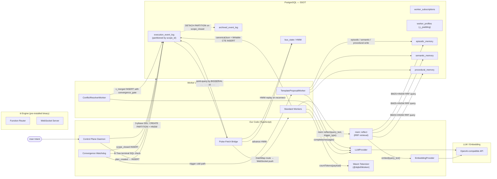
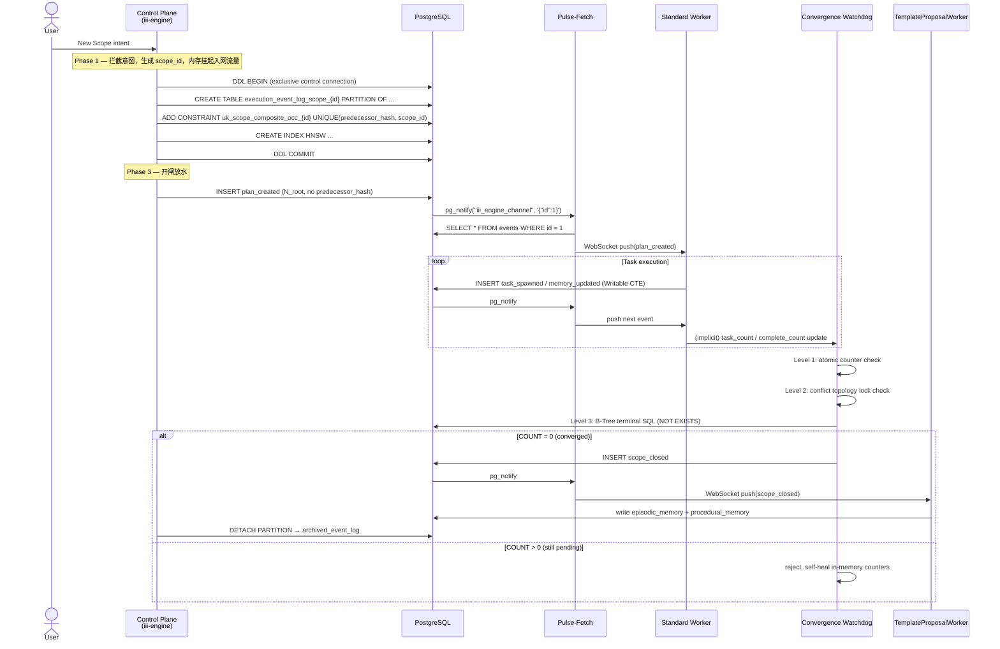
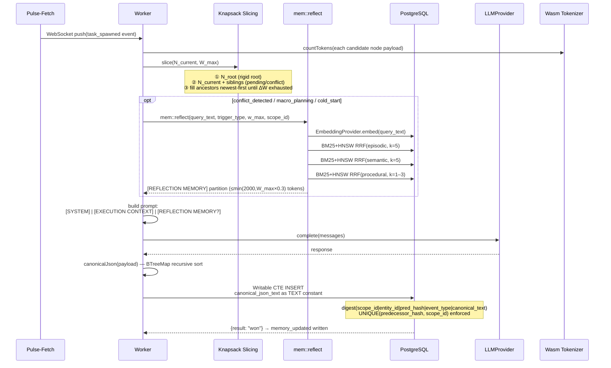
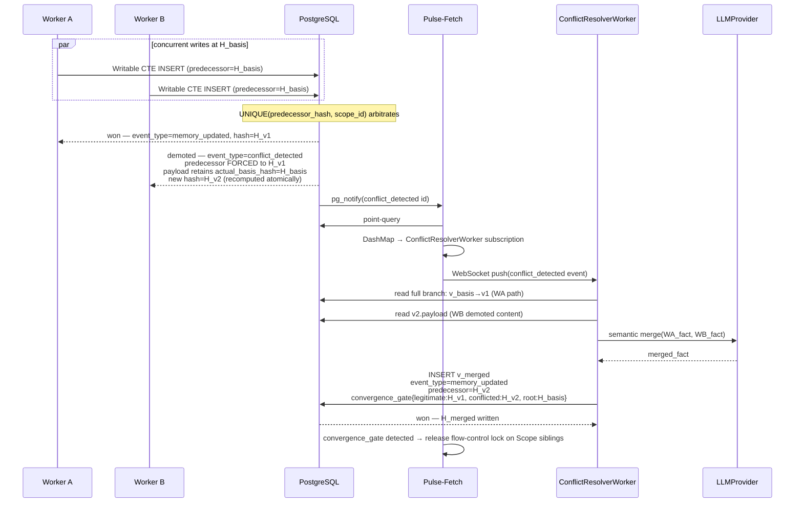
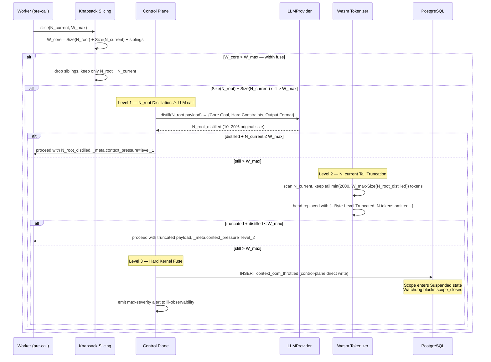
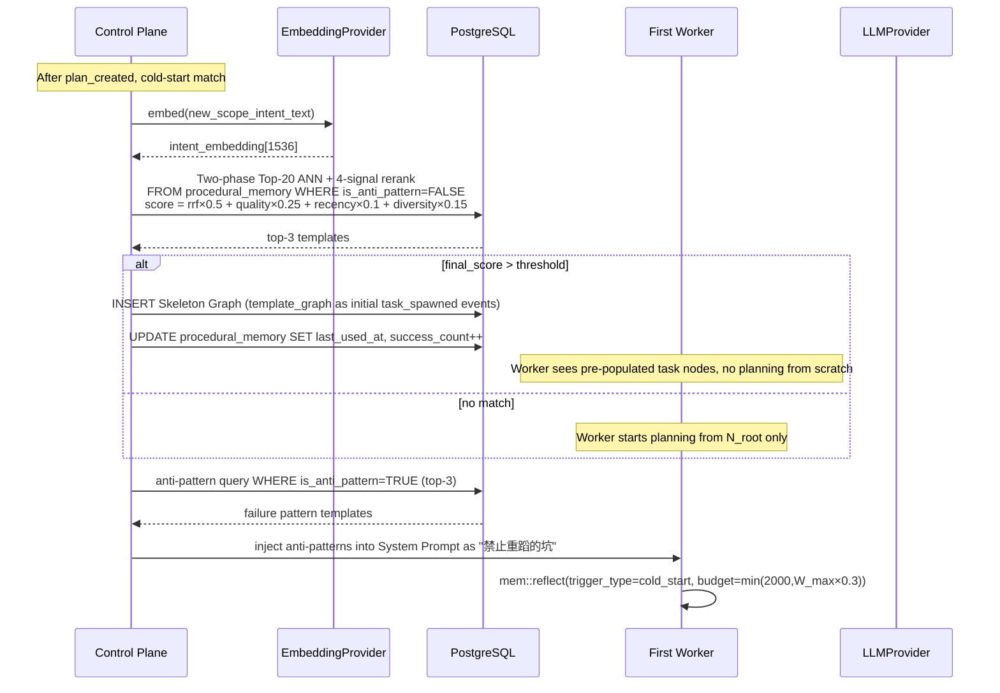

# Graph-Native Agent Runtime — Architecture Document

> 基于 23 条 ADR 的全面架构概述。本文档为 Phase 1 实施的规范性参考。

---

## 1. What & Why

本系统是一个**图原生 Agent 运行时**，将 AI Agent 的控制流、长期记忆、任务编排完全融合在一张 PostgreSQL append-only 事件图（Execution Graph）中。

核心设计原则借鉴区块链账本哲学：
- **不可变追加**：任何状态变更均为图的新节点（Version），不覆写历史
- **内容寻址**：每个节点以 SHA-256 Version Hash 唯一标识，scope_id 作为密码学盐值
- **去中心化编排**：无中央控制代码，Worker 通过事件总线订阅制驱动控制流前进（Choreography Pattern）
- **SSOT**：PostgreSQL 是单一事实来源，外部系统（向量库、缓存）仅是衍生层

三层解耦：
- **知识层（SSOT）** — PostgreSQL append-only 事件图 + 四层记忆表
- **控制层（大脑）** — Control Plane Daemon（我们的 TypeScript 代码）+ iii 引擎（现成二进制）：Pulse-Fetch 桥接、Knapsack Slicing、Watchdog
- **执行层（四肢）** — Workers（我们的 TypeScript 代码，通过 `iii-sdk` 注册）：SELECT/INSERT 权限，调用工具/LLM 后写回图

---

## 2. 组件架构图（ASCII）

> **重要边界说明（2026-06-01，ctx7 核实）**：  
> iii 是现成引擎二进制（安装使用，非本项目自行实现）。  
> 本项目自行实现的代码：**Control Plane Daemon**（TypeScript）+ **Workers**（TypeScript）。

```
╔══════════════════════════════════════════════════════════════════════════════╗
║        iii Engine Binary  (pre-installed, NOT our code)                      ║
║        Worker Registry · Function Routing · WebSocket Server                 ║
║        Storage backend: PostgreSQL or Redis (iii's own internal tables)      ║
╚═════════════════════════╤════════════════════════════════════════════════════╝
                          │ WebSocket  registerWorker() / iii.trigger()
        ┌─────────────────┴──────────────────────────────────────┐
        │                                                        │
╔═══════▼═══════════════════════════════════╗  ╔════════════════▼══════════════════╗
║  Control Plane Daemon  (OUR TypeScript)   ║  ║  Worker Layer  (OUR TypeScript)   ║
║                                           ║  ║                                   ║
║  ┌───────────────────────────────────┐    ║  ║  ┌──────────────────────────────┐ ║
║  │  Pulse-Fetch Bridge  (ADR 09)     │    ║  ║  │  Standard Workers            │ ║
║  │  pg-listen LISTEN/NOTIFY          │    ║  ║  │  • iii-sdk registerFn()      │ ║
║  │  → HWM advance (bus_state)        │    ║  ║  │  • SELECT/INSERT only DB     │ ║
║  │  → iii.trigger(worker::evt_type)  │    ║  ║  │  • canonicalJson + CTE write │ ║
║  └───────────────────────────────────┘    ║  ║  └──────────────────────────────┘ ║
║  ┌───────────────────────────────────┐    ║  ║  ┌──────────────────────────────┐ ║
║  │  3-Phase Nesting (ADR 05)         │    ║  ║  │  Synthesis Workers           │ ║
║  │  DDL exclusive connection pool    │    ║  ║  │  • ConflictResolverWorker    │ ║
║  │  CREATE PARTITION + HNSW          │    ║  ║  │  • TemplateProposalWorker    │ ║
║  └───────────────────────────────────┘    ║  ║  │  • SubScopeResultWorker      │ ║
║  ┌───────────────────────────────────┐    ║  ║  │    (Phase 3)                 │ ║
║  │  Convergence Watchdog (ADR 19)    │    ║  ║  └──────────────────────────────┘ ║
║  │  3-level defense · scope_closed   │    ║  ║  ┌──────────────────────────────┐ ║
║  └───────────────────────────────────┘    ║  ║  │  mem::reflect Function       │ ║
║  ┌───────────────────────────────────┐    ║  ║  │  (iii-registered, ADR 21)    │ ║
║  │  Direct-write control events      │    ║  ║  │  BM25+HNSW RRF retrieval     │ ║
║  │  context_oom_throttled (ADR 13s)  │    ║  ║  └──────────────────────────────┘ ║
║  │  sub_scope_resolved    (ADR 23)   │    ║  ╚════════════════════╤══════════════╝
║  └───────────────────────────────────┘    ║                       │
║  ┌───────────────────────────────────┐    ║  ╔════════════════════▼══════════════╗
║  │  Wasm Tokenizer (@dqbd/tiktoken)  │    ║  ║  LLM / Embedding Provider         ║
║  │  <1ms token count, ADR 15         │    ║  ║  OpenAI-compatible REST /v1/      ║
║  └───────────────────────────────────┘    ║  ║  ollama | llama.cpp | OpenAI      ║
╚═══════════════════════╤═══════════════════╝  ╚═══════════════════════════════════╝
                        │ DDL (exclusive) + SELECT/INSERT + LISTEN/NOTIFY
                        ▼
╔══════════════════════════════════════════════════════════════════════════════╗
║                       PostgreSQL  (SSOT)                                     ║
║                                                                              ║
║  execution_event_log  (PARTITION BY LIST scope_id)                           ║
║  ├─ scope_A   UNIQUE(predecessor_hash, scope_id)  ←── OCC 硬防线             ║
║  ├─ scope_B                                                                  ║
║  └─ ...                                                                      ║
║                                                                              ║
║  archived_event_log   (cold archive, no UNIQUE constraint)                   ║
║                                                                              ║
║  episodic_memory      (HNSW + tsvector BM25)                                 ║
║  semantic_memory      (partial HNSW, WHERE superseded_by IS NULL)            ║
║  procedural_memory    (±HNSW partial indexes + tsvector BM25)                ║
║                                                                              ║
║  bus_state            (HWM: last_processed_event_id)                         ║
║  worker_subscriptions (subscription cold backup)                             ║
║  worker_profiles      (△_padding per Worker channel)                         ║
║  scope_lineage        (parent-child scope metadata, Phase 3)                 ║
╚══════════════════════════════════════════════════════════════════════════════╝
```

**权限边界**（硬性约束）：
- Worker DB 账户：`SELECT / INSERT` only，无 DDL 权限
- Control Plane DDL 连接：独占，1–2 个连接，只在三阶段筑巢时使用
- 五大法定认知事件 + 2 个控制面直写信号（`context_oom_throttled` / `sub_scope_resolved`）

---

## 3. 数据流（Mermaid）



---

## 4. 关键时序流（Mermaid）

### 4.1 Scope 生命周期（筑巢协议 → 关闭）



---

### 4.2 正常 Worker 执行（含双轨检索）



---

### 4.3 OCC 因果倒置 + 收敛合并



---

### 4.4 Context OOM 三级降级链路



---

### 4.5 发散性反思轨道 — 冷启动骨架注入



---

## 5. Scope 生命周期状态机

```
                     ┌─────────────────────────────┐
  User Intent ──────▶│         INITIALIZING          │
                     │  (Control Plane DDL 3-phase)  │
                     └──────────────┬────────────────┘
                                    │ plan_created inserted
                                    ▼
                     ┌─────────────────────────────┐
         ┌───────────│           RUNNING             │◀──────────────┐
         │           │  Workers consuming events     │               │
         │           └──────────────┬────────────────┘               │
         │                          │                                 │
         │       conflict_detected  │  context_oom_throttled         │
         │       (auto CRW)         │  (control-plane direct write)  │ convergence_gate
         │                          ▼                                 │ detected
         │           ┌─────────────────────────────┐                 │
         │           │          SUSPENDED            │                 │
         │           │  Watchdog blocks scope_closed │                 │
         │           │  awaiting_intervention        │                 │
         │           └──────────────┬────────────────┘                 │
         │                          │ human unblocks                  │
         │                          └────────────────────────────────▶┘
         │
         │ Watchdog: 3-level defense passes (COUNT=0)
         ▼
         ┌─────────────────────────────┐
         │           CLOSED             │
         │  scope_closed inserted       │
         │  → cold archive DETACH       │
         │  → TemplateProposalWorker    │
         └─────────────────────────────┘
```

---

## 6. 内存热图与快照重建

iii-engine 在内存中维护活跃 Scope 的拓扑结构（`execution_event_log` 的内存投影）：

- **热图范围**：严格限定在单 scope_id 分区，不跨 Scope
- **重建策略**：快照 + 增量重放（O(1) 冷启动）
- **快照写入时机**：与 `scope_closed` 事件强对齐
- **增量追加**：冷启动后从 `last_event_id` 顺序追加，不触发全量重放

```
冷启动 = 反序列化 snapshot + stream(event_id > snapshot.last_id) ← O(1)
```

---

## 7. 订阅路由架构（DashMap Hot Path）

```
Worker 注册时 → iii-engine 在内存 DashMap 中注入路由规则：
  DashMap<EventType, Vec<WorkerHandle>>

事件到达时（pg_notify → point-query）：
  match event.event_type → DashMap lookup → WebSocket push to matching Workers

冷备份（Write-Behind，5秒阻尼器）：
  worker_subscriptions 表 ← 异步 Upsert

重启恢复：
  1. 读 worker_subscriptions 预物化骨架
  2. 心跳 Ping 确认存活后挂载句柄
  3. 驱逐无响应的幽灵连接
```

---

## 8. 哈希计算流水线（两阶段契约）

```
应用层（Rust/TypeScript）——阶段一（只做一次）：
  payload object
      │
      ▼ BTreeMap recursive sort (alphabetical key order)
  canonical_json_text: &str  ← immutable TEXT constant, never ::jsonb again

PostgreSQL 事务内核——阶段二（hash compute & re-compute）：
  content_input = "{scope_id}|{entity_id}|{predecessor_hash}|{event_type}|{canonical_json_text}"
      │
      ▼ pgcrypto digest(content_input, 'sha256')
  version_hash: SHA-256 hex string

Writable CTE 因果倒置时（predecessor_hash 改写后）：
  同一 canonical_json_text 常数 + 新 predecessor_hash → digest() → new version_hash
  不回调应用层，不做 ::jsonb 转换
```

---

## 9. 双轨检索上下文注入结构

```
[SYSTEM PROMPT]
  Core Schema Rules
  tRPC-like domain contracts (from procedural_memory)
  Anti-pattern injections (cold-start only)

[EXECUTION CONTEXT]   ← 确定性执行轨道（Knapsack Slicing）
  N_root (plan_created — rigid origin)
  [ancestors, newest→oldest, within ΔW budget]
  N_current (current processing node)
  S_siblings (pending / conflict_detected in same scope)

[REFLECTION MEMORY]   ← 发散性反思轨道（按需，3 触发场景）
  === Procedural ===   (LIMIT 1–3, budget ×0.6)
    template_graph JSON or summary if oversized
  === Episodic ===     (LIMIT 5, remaining budget)
    intent_summary, outcome_summary, error_patterns
  === Semantic ===     (LIMIT 5, remaining budget)
    fact_text (WHERE superseded_by IS NULL)

Token budget:
  W_max = W_physical - W_system_prompt - △_padding
  Reflection budget = min(2000, W_max × 0.3)
  Truncation order if over budget: Procedural > Episodic > Semantic (keep head)
```

---

## 10. 关联文档索引

| 主题 | 文档 |
|------|------|
| 完整 ADR 列表（ADR 01–22） | `docs/ADR_v4.md` |
| 系统 RFC（原始设计动机） | `docs/RFC_v4.md` |
| 领域术语表 | `CONTEXT.md` |
| BM25+HNSW RRF 混合检索规范 | `docs/adr/0021-adr20-supplement-hybrid-retrieval-bm25-rrf.md` |
| mem::reflect 接口与 Token 预算 | `docs/adr/0022-adr21-reflection-track-trigger-spec.md` |
| LLM/Embedding Provider 抽象 | `docs/adr/0023-adr22-llm-provider-abstraction.md` |
| Context OOM 三级降级链路 | `docs/adr/0024-adr13-supplement-context-oom-degradation.md` |
| 嵌套 Scope 传导协议（Phase 3） | `docs/adr/0025-adr23-nested-scope-propagation.md` |
| 开放问题追踪 | `docs/未决问题追踪.md` |
| Tech Stack 外部引用索引 | `docs/TECH_STACK.md` §7 |

---

## 11. 外部引用（External Citations）

> 本节列出架构中每个关键设计主张的外部文献支撑。所有库级引用均通过 ctx7 核实。

### 库 / 工具（官方文档，ctx7 核实）

| 组件 | 引用位置 | 官方来源 | ctx7 核实项 |
|------|---------|---------|-----------|
| **iii-sdk** | §2 Worker 连接模式，§4.2 时序流 | [github.com/iii-hq/iii](https://github.com/iii-hq/iii)，[quickstart.mdx](https://github.com/iii-hq/iii/blob/main/docs/quickstart.mdx) | `registerWorker(III_URL)`、`registerFunction(id, handler)`、`npm install iii-sdk` |
| **pgvector** | §2 HNSW 索引，§4.2 检索流 | [github.com/pgvector/pgvector](https://github.com/pgvector/pgvector) | `m=16, ef_construction=64` 是默认值；过滤器**后执行**（非下推）；`iterative_scan` 是 v0.8.0 新增 |
| **node-postgres (pg)** | §2 Writable CTE INSERT，§2.3 Control Plane | [github.com/brianc/node-postgres](https://github.com/brianc/node-postgres) | `Pool`、`client.on('notification')`（LISTEN/NOTIFY EventEmitter） |
| **@dqbd/tiktoken** | §3 Wasm Tokenizer，ADR 15 | [github.com/dqbd/tiktoken](https://github.com/dqbd/tiktoken)，[npm](https://www.npmjs.com/package/@dqbd/tiktoken) | tiktoken Rust → Wasm；`get_encoding('cl100k_base').encode(text)` |
| **pg-listen** | §2.3 Control Plane Daemon 桥接 | [github.com/andywer/pg-listen](https://github.com/andywer/pg-listen)，[npm](https://www.npmjs.com/package/pg-listen) | `createSubscriber`、`.listenTo(channel)`、`.notifications.on(channel, cb)` |
| **pgcrypto** | §4.2 pgcrypto，ADR 02 哈希计算 | [postgresql.org/docs/current/pgcrypto.html](https://www.postgresql.org/docs/current/pgcrypto.html) | `digest(content_input, 'sha256')` 返回 bytea；contrib 扩展内置 |
| **agentmemory** | §7 RRF 权重来源 | [github.com/rohitg00/agentmemory](https://github.com/rohitg00/agentmemory) | `BM25_WEIGHT=0.4, VECTOR_WEIGHT=0.6`；RRF `k=60`（源码直接确认） |

### 研究论文（核心算法依据）

| 设计主张 | 论文 | DOI / URL |
|---------|------|-----------|
| **RRF K=60 常数** | Cormack, G.V., Clarke, C.L.A., Buettcher, S. (2009). "Reciprocal Rank Fusion Outperforms Condorcet and Individual Rank Learning Methods." *SIGIR 2009* | https://dl.acm.org/doi/10.1145/1571941.1572114 |
| **OCC UNIQUE 约束裁决** | Kung, H.T. & Robinson, J.T. (1981). "On Optimistic Methods for Concurrency Control." *ACM TODS 6(2)* | https://dl.acm.org/doi/10.1145/319566.319567 |
| **mem::reflect 集中式反思** | MemR3: Memory-Retrieval and Reflection for Multi-Agent Systems (2024) | https://arxiv.org/abs/2512.20237 |
| **集中式反思接口设计** | Packer, C. et al. (2023). "MemGPT: Towards LLMs as Operating Systems." *arXiv:2310.08560* | https://arxiv.org/abs/2310.08560 |
| **Event Sourcing** | Fowler, M. — *Event Sourcing* | https://martinfowler.com/eaaDev/EventSourcing.html |
| **Choreography Pattern** | Hohpe, G. & Woolf, B. — *Enterprise Integration Patterns* | https://www.enterpriseintegrationpatterns.com/patterns/messaging/EventBus.html |
